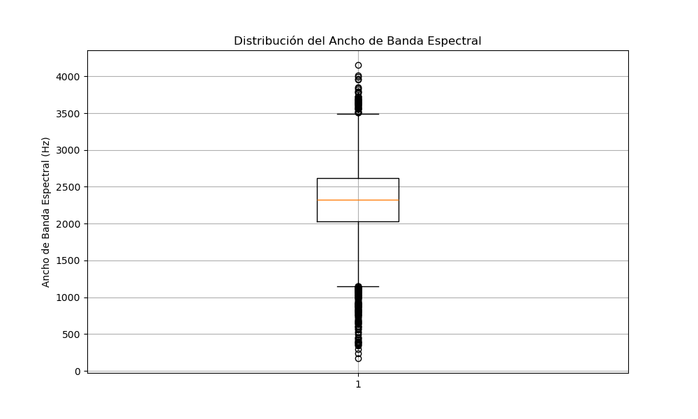

# Clasificador modulaciones

## Índice

1. [Introducción](#introducción)
2. [Modelo Multimodal](#modelo-multimodal)
3. [Transfer Learning](#transfer-learning)
4. [MobileNet](#mobilenet)
5. [Herramientas](#herramientas)
   - [Optuna](#optuna)
   - [PyTorch](#pytorch)
   - [Librosa](#librosa)
6. [Descripción del Dataset](#descripción-dataset)
7. [Selección de Features](#seleccion-features)
   - [Distribución Rolloff](#distribución-rolloff)
   - [Distribución Ancho de Banda](#distribución-ancho-de-banda)
   - [Distribución Ratio Cruce por Cero](#distribución-ratio-cruce-por-cero)
   - [Distribución Tempo](#distribución-tempo)
   - [Distribución Duración](#distribución-duración)
   - [Relación Tempo-Centroide](#relación-tempo-centroide)
   - [Relación Duracion-Centroide](#relación-duracion-centroide)
8. [Transformaciones](#tranformaciones)
9. [Entrenamiento del Modelo](#entrenamiento-modelo)
10. [Resultados](#resultados)

## Introducción
El objetivo de este proyecto es realizar un modelo multimodal de deeplearning capaz de clasificar los sonidos producidos por aves del dataset [xeno canto](https://xeno-canto.org/) con una precisión adecuada.
Para realizar dicha clasificación al modelo se le va a pasar tanto una imagen del espectrograma de la señal de audio, como un vector con las "features" más significativas de las señales de audio.
Estas features se escogen en el apartado [seleccion features](#seleccion-features)

De esta forma se realiza un modelo [multimodal](#modelo-multimodal), ya que en la entrada se introducen dos tipos de dato diferentes.

A modo de comparación, el modelo entrenado se va a comparar con el dataset generado en el repositorio [repositorio kaggle](https://www.kaggle.com/competitions/deep-learning-based-modulation-classification/overview).

Para entrenar la parte de clasificación de features del modelo, se han empleado técnicas de transferlearning, descritos en el siguiente [apartado](#tranfer-learning).

Para la parte de clasificación de las features del audio, se ha escogido una red neuronal lineal.
El modelo completamente descrito se puede encontrar en el apartado [entrenamiento modelo](#entrenamiento-modelo).

## Modelo multimodal

Un modelo **multimodal** es un tipo de modelo de inteligencia artificial diseñado para procesar y analizar múltiples tipos de datos o modalidades, como texto, imágenes, y audio. Estos modelos integran diversas fuentes de información para mejorar la precisión y eficacia en la realización de tareas complejas. Son particularmente útiles en aplicaciones como la educación, la automoción con vehículos autónomos, la salud, y los asistentes personales, donde la combinación de diferentes tipos de datos permite a las máquinas ofrecer respuestas más precisas y contextualizadas. Al aprender cómo las distintas modalidades se complementan entre sí, los modelos multimodales representan un avance significativo en la capacidad de los sistemas de inteligencia artificial para interpretar y actuar en el mundo real.
## Transfer Learning
El **Transfer Learning** es una técnica de aprendizaje automático que se centra en almacenar el conocimiento adquirido al resolver un problema y aplicarlo a un problema diferente pero relacionado. En otras palabras, en lugar de empezar el aprendizaje desde cero, el modelo utiliza conocimientos previamente aprendidos de una tarea para mejorar o acelerar el aprendizaje en otra nueva tarea.

Para cada modelo empleado se va a sustituir la parte de clasificación del modelo por una red neuronal personalizada. Además dentro de cada modelo preentrenado, se van a descongelar capas de forma secuencial hasta que se obtenga la precisión esperada. Esto se hace para adaptar aún más el modelo base conforme al problema de clasificación que se quire solucionar.

A modo de resumen se adjunta una ilustración en la que se diferencian las partes de los modelos finales que se va a emplear en la predicción:

  

El proceso de entrenamiento en detalle se describe en el apartado [entrenamiento modelo](#entrenamiento-modelo).

El modelo modelo que se ha escogido para entrenar con transferlearning es mobileNet ya que en anteriores ocasiones se ha conseguido una precisión muy alta realizando transferlearning

## MobileNet
**MobileNet** es una arquitectura de red neuronal optimizada para su uso en dispositivos móviles y en entornos con recursos limitados. Utiliza técnicas como separaciones de convoluciones en profundidad para reducir el número de parámetros y la cantidad de cálculos necesarios, lo cual es ideal para aplicaciones en tiempo real.

## Herramientas
En este proyecto se han utilizado varias herramientas de vanguardia en el campo del aprendizaje automático y el desarrollo de aplicaciones. A continuación, se describe cada una de ellas.

### Optuna
**Optuna** es una biblioteca de optimización de hiperparámetros diseñada específicamente para la automatización del ajuste de hiperparámetros. Optuna permite definir un espacio de búsqueda complejo de hiperparámetros y utiliza varios algoritmos de optimización para encontrar de manera eficiente la mejor configuración. Esta herramienta es ampliamente utilizada en el ámbito del aprendizaje automático para mejorar el rendimiento de los modelos al ajustar parámetros como la tasa de aprendizaje, el número de capas en una red neuronal, o la cantidad de nodos en cada capa.

### PyTorch
**PyTorch** es un framework de aprendizaje profundo y computación tensorial con aceleración de GPU. Es conocido por su flexibilidad y su diseño intuitivo, lo que facilita tanto la investigación experimental como el desarrollo de aplicaciones de producción. PyTorch proporciona una rica API para operaciones tensoriales y una gran colección de herramientas y bibliotecas preconstruidas para visión por computadora, procesamiento del lenguaje natural y más. En este proyecto, PyTorch se utiliza para construir y entrenar modelos de redes neuronales.

### Librosa
**Librosa** es una biblioteca de Python diseñada para el análisis de música y audio que facilita la carga, el análisis y la manipulación de datos de audio. Provee funcionalidades esenciales para la extracción de características como espectrogramas, MFCCs, y frecuencia fundamental, además de soportar transformaciones temporales y espectrales importantes para el análisis espectral. Es muy utilizada en investigación musical por su capacidad de integrarse con otras herramientas de ciencia de datos de Python, permitiendo análisis avanzados y visualizaciones complejas. Su flexibilidad y robustez la hacen indispensable en el campo del procesamiento de señales de audio.

## Descripción dataset
Para este proyecto se ha obtenido el dataset de Xeno Canto directamente, es por ello que es necesario realizar un análisis exploratorio de los datos para conocer con exactitud la distribución de los datos y saber que tipo de datos son con los que se está trabajando.
Se ha de comprobar que el dataset generado está balanceado y que no hay clases más predominantes que otras, por ello se ha generado una gráfica con la distribución de las clases:

  

Por inspección visual se puede comprobar que no todas las clases son igual de frecuentes, en el caso de que la tasa de error no se encuentre correctamente distribuida, se tomarán las medidas que se consideren oportunas.

El dataset tiene un total de 259 clases diferentes.
### Seleccion features
Para elegiar que features son las más significativas para poder realizar el entrenamiento de la forma más eficiente posible, se han calculado todas las features posibles que se puede extraer de un fichero de audio empleando la libreria [librosa](#librosa).
A continuación se representa la distribución de cada una de esas features para saber si son significativas o no:

#### Distribución Rolloff

El rolloff de una señal, también conocido como roll-off de frecuencia, es una medida que describe la tasa a la que una señal disminuye su amplitud o energía más allá de una determinada frecuencia. Comúnmente se utiliza en el procesamiento de señales y audio para definir el punto en el espectro de frecuencia donde la energía cae por debajo de un umbral específico, como el 85% del total de la energía. Este parámetro es útil para analizar el contenido espectral y las características de la señal, ayudando a identificar y separar componentes de baja y alta frecuencia

  

Analizando el diagrama de caja, se puede ver como existen numerosos outliers en los datos, por lo que esta va a ser una de las features escogidas para el modelo.

#### Distribución ancho de banda

El ancho de banda de una señal se refiere a la diferencia entre las frecuencias más altas y más bajas presentes en una señal, abarcando el rango en el que la mayoría de la energía de la señal se concentra. Este parámetro es fundamental en telecomunicaciones, procesamiento de señales y tecnologías de la información, ya que determina la capacidad de un canal o sistema para transmitir información. Un mayor ancho de banda indica una capacidad superior para transmitir datos rápidamente y manejar una gama más amplia de frecuencias, lo que es crucial para aplicaciones como la transmisión de video, audio y datos en general.

  

Examinando el diagrama de caja, se observa la presencia de varios valores atípicos en los datos, lo cual indica que esta será una de las características seleccionadas para el modelo.
#### Distribución ratio cruce por cero

El ratio de cruce por cero de una señal se refiere a la tasa a la que la señal cambia de signo, pasando de positivo a negativo o viceversa. Este parámetro es comúnmente utilizado para analizar la naturaleza de las señales en el tiempo, particularmente en el procesamiento de audio y en la detección de características en señales de voz. Cuantifica la frecuencia de los cambios de signo y puede ser indicativo de la frecuencia general de una señal y su contenido de ruido.

  

En el histograma se observa una distribución adecuada de los datos, por lo tanto, esta va a ser una de las características pasadas al modelo.
#### Distribución tempo

El tempo de una señal de audio se refiere a la velocidad a la que se reproduce la música, medida generalmente en pulsos o golpes por minuto (BPM). Este parámetro es crucial en la música para determinar la rapidez de la pieza y proporciona un marco de referencia para el tiempo y el ritmo en la ejecución de las composiciones. El tempo afecta directamente la percepción y el ambiente de la música, influyendo en cómo se siente la intensidad y el estado de ánimo general de la obra.

  

El histograma muestra una distribución adecuada de los datos, por lo que esta característica será incluida en el modelo.
#### Distribución duración
La duración de una señal se refiere al tiempo total durante el cual la señal está definida o es efectivamente significativa. En el contexto de procesamiento de señales, la duración puede indicar cuánto tiempo una señal de audio o vídeo está activa o cuánto tiempo una señal de comunicaciones transmite información

  

El histograma revela que la distribución de los datos no es adecuada, por lo tanto, esta característica no será incluida en el modelo.

#### Relación tempo-centroide
El centroide espectral de una señal se refiere a la "media ponderada" de las frecuencias presentes en la señal, considerada como su "centro de gravedad" espectral. Este parámetro es un indicador importante del brillo o la "tonalidad" percibida de una señal de sonido, donde un centroide más alto sugiere un sonido más brillante y uno más bajo indica un sonido más oscuro o apagado. En el procesamiento de audio, el centroide espectral se utiliza para analizar y diferenciar timbres y características sonoras, siendo útil en aplicaciones como la clasificación de música, el reconocimiento de instrumentos y la mejora de la calidad de audio.

  

#### Relación duracion-centroide

  

# Tranformaciones
Antes de pasar la imagen por el modelo, a cada señal de audio se le va a calcular el espectrograma así como el cálculo de las features más significativas.
A modo de ejemplo se adjuntan varios espectrogramas de señales obtenidas del dataset:

  

  

Como se podrá observar la imagen se encuentra en escala de grises, esto es porque al modelo no se le pasa el espectrograma directamente, si no que se normaliza previamente para pasarle al modelo únicamente el módulo de la densidad espectral de potencia en una frecuencia en concreto en un instante determinado.

## Entrenamiento modelo
Para realizar el entrenamiento del modelo, se va a hacer uso de varias técnicas y herramientas.

La primera de todas es que se va a hacer uso de Optuna como herramienta para encontrar los parámetros óptimos del modelo. En concreto en este modelo se han optimizado: la tasa de aprendizaje, el número de capas en una red neuronal de clasificación, el número de neuronas en cada capa, el valor de dropout de la capa previa cada capa lineal en el segmento de clasificación. 

Para poder encontrar los parámetros óptimos, se tiene que definir un espacio de búsqueda de estos. 
Optuna ejecuta esta función objective, la cual realiza el entrenamiento y devuelve un valor de rendimiento que Optuna usa para guiar la búsqueda de la configuración óptima.

Por otro lado, para evitar tanto overfitting, como tiempos de entrenamiento elevados en epochs que ya no aportan beneficio en el conjunto de validación, se va a incorporar un algoritmo de early stopping.

Este algoritmo obtiene el error de validación en cada una de las iteraciones del entrenamiento, si el error de validación no disminuye en 30 iteraciones, el intento se considera como finalizado y se deja de entrenar. Después de esto se buscan otros parámetros nuevos obtenidos de optuna, y se comienza el proceso de nuevo.

El diagrama de flujo seguido en el entrenamiento es el siguiente:

  

La features del audio que se han escogido para el entrenamiendo del modelo son:
- Centroide espectral
- Ratio cruce por cero
- Roll off espectral
- Tempo
- Ancho banda espectral
## Resultados
Los resultados obtenidos fruto del entrenamiento no son muy alentadores, puesto que la precisión total obtenida es de tan solo un 8%. Esto es debido a que el dato que se quiere clasificar es muy complicado con mucho matices. Además la red qeu se ha seleccionado es posible que sea demasiado sencilla para poder capturar toda la complejidad de los datos y de las características extraidas.
### Importancia parámetros
Al evaluar cuál parámetro tiene mayor influencia en la precisión del modelo, se ha generado el siguiente gráfico:
 

Esto tiene sentido puesto que el parámetro neuronas_spectrogram es el número de neuronas que tiene la red neuronal que recibe las características extraidas, entonces el núemro de neuronas que analiza dichas características es crítico.
### Distribución error
Al analizar la distribución del error en las clasificaciones, se ha obtenido el siguiente gráfico:

 

El error está disitrbuido de forma correcta, no hay clases que tengan un error mucho mayor que los demás, el problema es que la precisión es muy baja. En el caso de que la precisión hubiera sido mayor, este modelo habría sido adecuado para poder clasificar aves en función de su sonido.

### Precisión
Al finalizar el entrenamiento se realiza el análisis de la precisión del modelo. Este modelo tiene una precisión del 7.5% en el conjunto de validación.

 

Además se ha obtenido la curva del error a medida que se avanza en el entrenamiento. 

La diferencia entre el error de validación y el error de clasificación en el conjunto de train es lo suficientemente pequeña como para afirmar que no existe overfitting, pero, la precisión no es lo suficientemente alta como para considerar este modelo como adecuado para la tarea designada.

